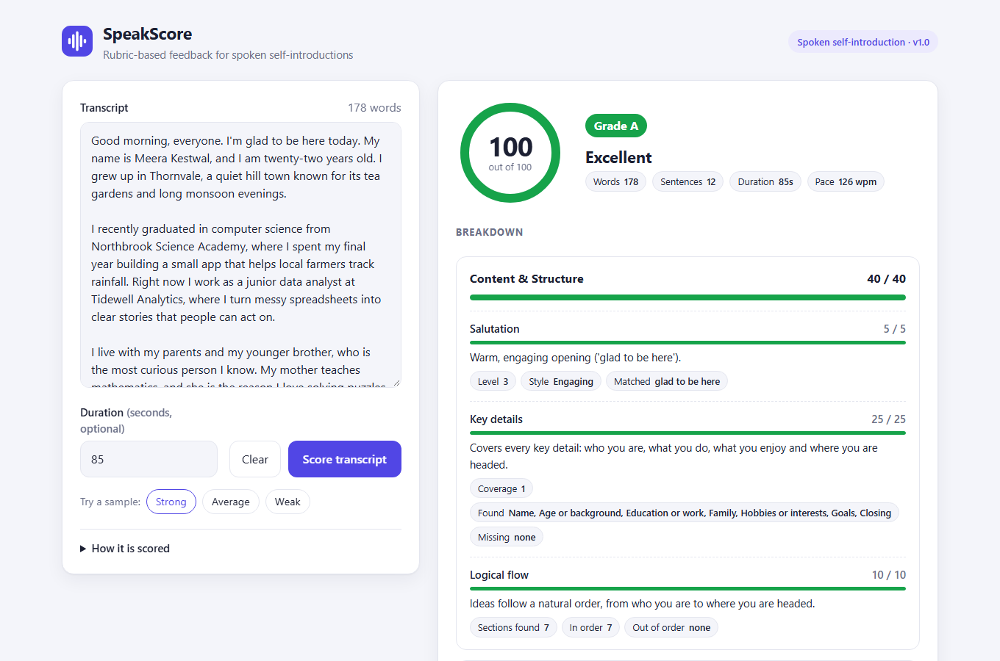
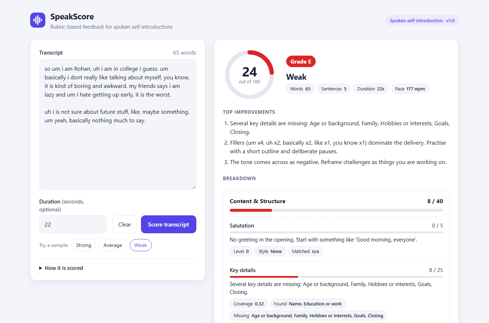
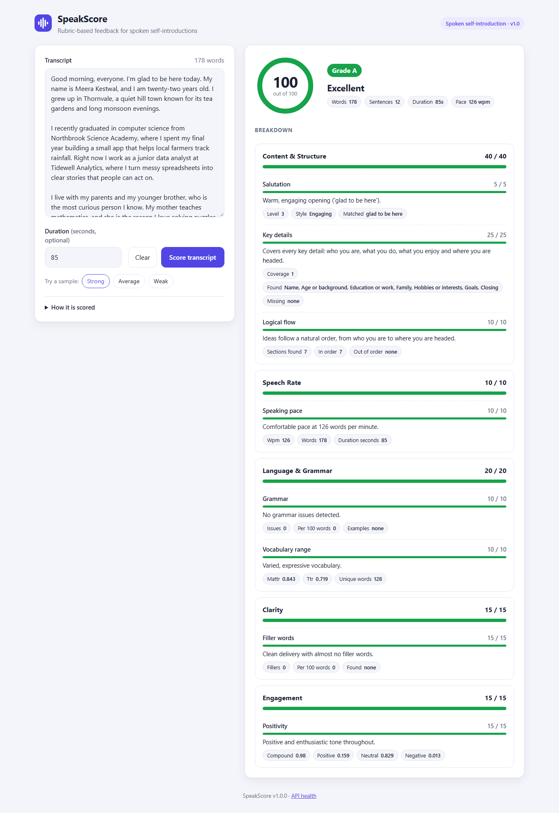
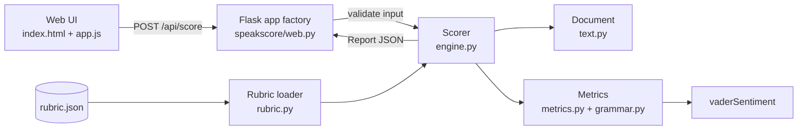

# SpeakScore

Rubric-driven scoring and actionable feedback for spoken self-introduction transcripts.

[](https://github.com/Raja9964/SpeakScore/actions/workflows/ci.yml)



| Weak sample with top improvements | Full breakdown |
| --- | --- |
|  |  |

## Features

- Scores a transcript out of 100 against a JSON rubric with five weighted criteria and returns a letter grade.
- Every check reports its score, maximum, raw metric values and a feedback sentence; the three biggest point losses are surfaced as "top improvements".
- Speech rate from an optional recording duration; when it is missing, that criterion is skipped and the rest are rescaled.
- Lightweight, explainable metrics: phrase detection, rule-based grammar checks, MATTR vocabulary richness, filler-word rate and VADER sentiment. No ML models to download.
- A reliability gate that scales scores down for very short, keyword-stuffed or repetitive input.
- JSON API with input validation (clear 400 messages) and a health endpoint.
- Single-page web UI with sample transcripts, a score ring, per-criterion bars and metric chips.
- The rubric is validated on load (weights must add up to 100, bands must cover every value, regexes must compile).

## How scoring works

The default rubric lives in [`speakscore/rubric.json`](speakscore/rubric.json). Each criterion is made of checks; each check runs one metric and maps its value to a fraction of its points, either through **bands** (`[min, max)` ranges, first match wins) or **linearly** between two bounds.

| Criterion | Weight | Check | Metric | Scoring |
| --- | ---: | --- | --- | --- |
| Content & Structure | 40 | Salutation (5) | Best greeting in the first 30 words: casual, polite or engaging | Bands: engaging 100%, polite 80%, casual 50%, none 0% |
| | | Key details (25) | Weighted share of 7 sections found: name, age or background, education or work, family, interests, goals, closing | Linear 0 to 1 |
| | | Logical flow (10) | Longest run of sections in the expected order / sections found (needs at least 3) | Linear 0 to 1 |
| Speech Rate | 10 | Speaking pace (10) | `words / (duration_seconds / 60)` | Bands: 110-150 wpm 100%, 90-110 or 150-170 70%, 70-90 or 170-200 40%, otherwise 10% |
| Language & Grammar | 20 | Grammar (10) | Rule-based issues per 100 words | Linear: 0 issues = full, 6+ = zero |
| | | Vocabulary range (10) | MATTR (moving-average type-token ratio, 50-word window) | Linear from 0.45 to 0.70 |
| Clarity | 15 | Filler words (15) | Fillers per 100 words (um, uh, "you know", "like," ...) | Bands: <1 100%, <3 75%, <6 45%, <10 20%, otherwise 0% |
| Engagement | 15 | Positivity (15) | VADER compound sentiment (-1 to 1) | Bands: >=0.9 100%, >=0.6 80%, >=0.2 55%, >=-0.2 30%, otherwise 10% |

Formulas:

```text
check score     = points x fraction(value) x reliability
criterion score = weight x (sum of scored check points / sum of scored check maxima)
overall         = 100 x sum(scored criterion scores) / sum(scored criterion weights)

reliability = min(1, words / 50)
            x min(1, function-word ratio / 0.30)    # keyword lists have almost no "the", "and", "my" ...
            x min(1, MATTR / 0.55)                  # copy-pasted phrases repeat the same words
```

Grades: A 85+, B 70+, C 55+, D 40+, E below 40.

The grammar checker is deliberately conservative: subject-verb agreement after pronouns ("she are"), a/an misuse, repeated words, double comparatives, "could of", progressive "having" for possession, lowercase "i" and sentence-initial lowercase (only when the text uses capitals at all), run-on sentences over 40 words, and verbless sentences in the middle of the text. It is a signal, not a full grammar engine.

Results on the bundled samples: `strong.txt` 100 (A), `average.txt` 81.4 (B), `weak.txt` 23.5 (E). A pure keyword list scores 8, and a repeated "my name is my family my hobbies ..." string scores about 31.

## Tech stack

Python 3.11+, Flask 3, vaderSentiment, python-dotenv, vanilla HTML/CSS/JS, pytest and ruff, GitHub Actions.

## Architecture



The engine knows nothing about specific criteria: it looks up each check's `metric` name in a registry, runs it on the parsed `Document`, and applies the rubric's bands or linear range. Changing weights, thresholds, phrases or feedback text only needs a rubric edit.

## Project structure

```text
speakscore/
  engine.py        Scorer, metric registry, reliability gate, report dataclasses
  metrics.py       salutation, coverage, order, speech rate, grammar, vocabulary, fillers, sentiment
  grammar.py       rule-based grammar checks
  rubric.py        rubric dataclasses and validating loader
  rubric.json      default rubric
  text.py          normalisation, tokens, sentences, MATTR, function-word ratio
  web.py           Flask app factory and /api blueprint
  templates/       index.html
  static/          style.css, app.js
samples/           fictional transcripts and samples.json (durations for the UI)
tests/             pytest suite
docs/screenshots/  README images
```

## Getting started

Requires Python 3.11 or newer.

```bash
git clone https://github.com/Raja9964/SpeakScore.git
cd SpeakScore
python -m venv .venv
```

Activate the environment:

```bash
# Windows (PowerShell)
.venv\Scripts\Activate.ps1
# Windows (Git Bash)
source .venv/Scripts/activate
# macOS / Linux
source .venv/bin/activate
```

Install and run:

```bash
pip install -r requirements.txt
flask run            # http://127.0.0.1:8000 (settings come from .flaskenv)
```

Optional configuration: copy `.env.example` to `.env`. `FLASK_DEBUG=1` enables debug mode (off by default); `SPEAKSCORE_RUBRIC_PATH`, `SPEAKSCORE_SAMPLES_DIR` and `SPEAKSCORE_MAX_TRANSCRIPT_CHARS` override the defaults.

## API reference

### `POST /api/score`

| Field | Type | Required | Notes |
| --- | --- | --- | --- |
| `transcript` | string | yes | Non-empty, at most 20,000 characters |
| `duration_seconds` | number | no | Greater than 0 and at most 3600; enables speech rate |

```bash
curl -X POST http://127.0.0.1:8000/api/score \
  -H "Content-Type: application/json" \
  -d '{"transcript": "Hello. My name is Kabir Solanki and I am fifteen years old. ...", "duration_seconds": 50}'
```

Response (shortened; `criteria` contains all five criteria):

```json
{
  "score": 81.4,
  "grade": "B",
  "label": "Good",
  "criteria": [
    {
      "id": "speech_rate",
      "name": "Speech Rate",
      "score": 7.0,
      "max": 10.0,
      "scored": true,
      "checks": [
        {
          "id": "pace",
          "label": "Speaking pace",
          "score": 7.0,
          "max": 10.0,
          "value": 104.4,
          "metrics": {"wpm": 104, "words": 87, "duration_seconds": 50.0},
          "feedback": "Slightly slow at 104 words per minute. Aim for 110 to 150."
        }
      ]
    }
  ],
  "improvements": [
    "Noticeable fillers (um x1, uh x1, like x1, basically x1). Slow down and pause instead of filling silence.",
    "Slightly slow at 104 words per minute. Aim for 110 to 150.",
    "Generally positive. Share what genuinely excites you to sound more engaged."
  ],
  "reliability": {"factor": 1.0, "length": 1.0, "naturalness": 1.0, "diversity": 1.0},
  "stats": {"words": 87, "sentences": 10, "duration_seconds": 50.0, "wpm": 104},
  "warnings": [],
  "rubric": {"name": "Spoken self-introduction", "version": "1.0"}
}
```

Errors return JSON with an `error` message, for example `400 {"error": "'transcript' is required and must be a string."}`. Wrong methods, unknown `/api` routes and oversized bodies return JSON 405, 404 and 413 responses.

### `GET /api/health`

```json
{"status": "ok", "version": "1.0.0", "rubric": "Spoken self-introduction"}
```

### From Python

```python
from speakscore import score_transcript

report = score_transcript(open("samples/strong.txt").read(), duration_seconds=85)
print(report.score, report.grade)
```

## Testing

```bash
pip install -r requirements-dev.txt
pytest
ruff check . && ruff format --check .
```

The suite covers each metric and grammar rule, the rubric loader's validation errors, the API's success and error responses, and sanity checks: the strong sample scores at least 75, the weak sample scores below 40, keyword stuffing scores below 40, and empty input is rejected.

## License

[MIT](LICENSE) (c) 2026 Raja Mohamad
